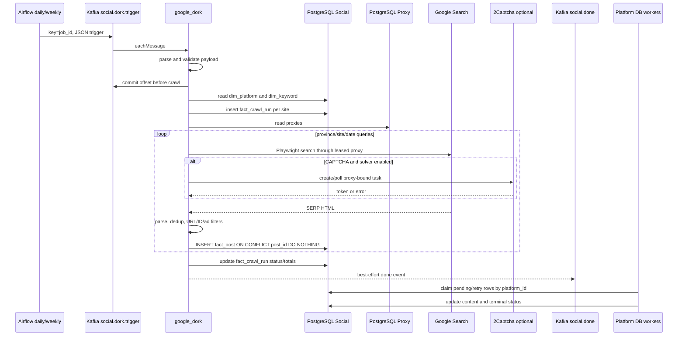
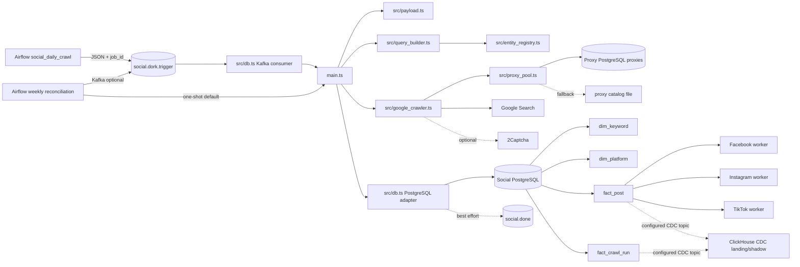

# Social Google Dork Discovery

## 1. Tổng quan

`Social/google-dork` là runtime Node.js/TypeScript dùng Playwright để tìm URL bài viết mạng xã hội trên Google, lọc kết quả và đưa URL mới vào hàng đợi PostgreSQL `fact_post`. Service không cào nội dung bài viết, không phân tích sentiment và không trực tiếp kích hoạt crawler Facebook/Instagram/TikTok.

| Thuộc tính | Giá trị đã xác nhận |
| --- | --- |
| Input | Kafka JSON từ `social.dork.trigger`, hoặc biến môi trường ở chế độ one-shot |
| Output chính | `fact_post` với `status='pending'`; `fact_crawl_run` để theo dõi discovery |
| Output phụ | Kafka daemon: event best-effort lên `social.done`; one-shot không publish event |
| Trigger theo lịch | Airflow `social_daily_crawl`; Airflow `social_weekly_reconciliation` |
| Trigger trực tiếp | Kafka daemon hoặc one-shot CLI/container qua biến môi trường |
| Dữ liệu đọc | `dim_platform`, `dim_keyword`, proxy DB `proxies`, registry tỉnh trong code |
| Dữ liệu ghi | `fact_post`, `fact_crawl_run` |
| External service được gọi | Google Search, PostgreSQL Social, PostgreSQL Proxy, Kafka; 2Captcha và rotating-reset endpoint khi cấu hình |
| Downstream đã xác nhận | Facebook, Instagram và TikTok claim các row `fact_post` theo `platform_id` và trạng thái queue |
| HTTP API nội bộ | Không có server/route HTTP trong source |

Luồng chính:

```text
Airflow/Kafka hoặc one-shot env
-> validate payload
-> đọc platform + keyword/province
-> dựng Google dork
-> Playwright qua proxy
-> lọc URL/post ID/quảng cáo
-> INSERT fact_post + cập nhật fact_crawl_run
-> publish social.done best-effort (Kafka daemon only)
-> crawler nền tảng claim fact_post ở bước downstream độc lập
```

Evidence:

- `Social/google-dork/main.ts:L234-L422` - `runJob()` điều phối discovery và ghi thống kê.
- `Social/google-dork/src/db.ts:L162-L260` - đọc dimension, ghi `fact_post`/`fact_crawl_run`.
- `Airflow/dags/social_daily_crawl.py:L184-L226` - producer Kafka daily.
- `Social/facebook/src/worker.ts:L47-L103`, `Social/instagram/instagram_scraper/database.py:L738-L806`, `Social/tiktok/src/db.py:L54-L116` - downstream đọc queue PostgreSQL.

## 2. Phạm vi folder

Folder được phân tích: `Social/google-dork/`.

Trong phạm vi:

- Runtime `main.ts`, probe `accuracy_probe.ts` và preflight `preflight_audio_probe.ts`.
- Cấu hình, payload validation, query builder, registry, crawler, proxy pool, CAPTCHA, logging và PostgreSQL/Kafka adapter trong `src/`.
- Dockerfile, Compose, `.env.example`, TypeScript/ESLint/package contract và tests.
- `entity_registry.csv` chỉ được xem là artifact tham khảo; không tìm thấy code runtime đọc file này.

Dependency ngoài folder đã đối chiếu:

- `Airflow/dags/social_daily_crawl.py` và `Airflow/dags/social_weekly_reconciliation.py`.
- `Airflow/docker-compose.yml` cho Kafka, topic init và Debezium Connect.
- `docker-compose.yml` ở root cho PostgreSQL Social/Proxy và external network.
- `Social/postgres/init.sql` và `proxy/proxy_init.sql` cho DDL.
- `Social/facebook`, `Social/instagram`, `Social/tiktok` cho queue consumers.
- `clickhouse/ddl/cdc_poc/*` cho CDC landing, transform và shadow views.
- `bot/teams_social_done_consumer.py` và `Airflow/dags/social_monthly_scrape.py` để kiểm tra consumer `social.done`.

Ngoài phạm vi README:

- Nội bộ scraper nội dung của từng platform, sentiment pipeline và vận hành production.
- Nội dung `.env`, dữ liệu proxy, logs, ClickHouse data volume và database backup.
- Trạng thái container, consumer lag, row count, connector runtime và throughput hiện tại.

## 3. Cây cấu trúc source code

```text
Social/google-dork/
├── main.ts                    # Kafka daemon/one-shot orchestration
├── accuracy_probe.ts          # Probe Google/proxy không ghi Social DB
├── preflight_audio_probe.ts   # Inspect audio control, không tải audio/ghi DB/Kafka
├── src/
│   ├── accuracy_probe.ts      # Shared probe config, guards và metrics
│   ├── config.ts              # Parse và validate env
│   ├── payload.ts             # Validate trigger contract
│   ├── db.ts                  # PostgreSQL + Kafka consumer/producer
│   ├── entity_registry.ts     # Province slug, tier, place entities
│   ├── platforms.ts           # Site alias, query text, post ID, URL/ad filters
│   ├── query_builder.ts       # Date windows và Google operators
│   ├── google_crawler.ts      # Playwright SERP, pagination, retry, CAPTCHA
│   ├── proxy_pool.ts          # Proxy DB/file load, lease, cooldown, reset
│   ├── captcha_solver.ts      # 2Captcha client
│   ├── local_captcha_solver.ts # Local audio solver qua ffmpeg/Vosk
│   ├── logger.ts              # Text/JSON logger, KafkaJS log adapter
│   ├── preflight_audio.ts     # Preflight reCAPTCHA audio-control report
│   ├── validator.ts           # Reachability placeholder
│   ├── url_filter.ts          # Re-export URL filter
│   ├── vosk_transcriber.ts    # Isolated Vosk worker supervisor
│   ├── vosk_worker.ts         # Worker process gọi libvosk
│   └── types.ts               # Crawler contracts
├── tests/                     # Node test runner regression tests
├── Dockerfile                 # Multi-stage build, non-root runtime
├── docker-compose.yml         # Always-on daemon config
├── package.json               # Node >=20, build/test/lint scripts
├── tsconfig.json              # strict TypeScript -> dist/
├── .env.example               # Một phần env contract
├── entity_registry.csv        # Export tham khảo, không phải runtime input
└── README.md
```

Evidence:

- `Social/google-dork/tsconfig.json:L2-L17` - build input/output và strict mode.
- `Social/google-dork/package.json:L6-L37` - scripts và dependencies.
- `Social/google-dork/package-lock.json:L1-L30` - lockfile v3 và root dependency contract.
- `Social/google-dork/.dockerignore:L1-L10` - source/image exclusions.

## 4. Runtime và entry point

Entry point thực tế được lần theo chuỗi:

```text
docker-compose.yml service google-dork
-> build Dockerfile
-> Dockerfile ENTRYPOINT ["node", "dist/main.js"]
-> compiled main.ts
-> main()
```

Khởi động daemon:

```text
Container start
-> import dotenv/config
-> loadConfig() tại import time
-> tạo PostgreSQL Pool; DATABASE_URL bắt buộc
-> log config đã mask credential
-> retry loadPlatformCache tối đa 20 lần
-> init best-effort done producer
-> connect + subscribe trigger consumer
-> process eachMessage
```

Khởi động one-shot:

```text
KAFKA_ENABLED=false
-> đọc SEARCH_* và RUN_TYPE
-> parseDorkTriggerPayload()
-> runJob()
-> close Kafka/browser/DB
-> exit
```

Shutdown và cleanup:

- Daemon đăng ký `SIGTERM` và `SIGINT`, lần lượt đóng Kafka consumer, done producer, Chromium và PostgreSQL rồi `process.exit(0)`.
- Fatal error ở `main().catch()` cố đóng cùng các resource; lỗi cleanup bị bỏ qua và process thoát mã 1.
- Mỗi proxy attempt đóng `BrowserContext` trong `finally`; Chromium dùng singleton và chỉ đóng khi shutdown.
- Compose có `init: true`, `stop_grace_period: 30s`, `restart: always`.
- Không có health endpoint hoặc Docker healthcheck cho container `google_dork`.

Evidence:

- `Social/google-dork/docker-compose.yml:L4-L13` - service lifecycle.
- `Social/google-dork/Dockerfile:L19-L29` - runtime image, user và entrypoint.
- `Social/google-dork/main.ts:L424-L553` - mode selection, signal handling và fatal cleanup.
- `Social/google-dork/src/google_crawler.ts:L73-L92`, `Social/google-dork/src/google_crawler.ts:L315-L387` - browser/context lifecycle.

## 5. Thành phần nội bộ

| Component | File | Vai trò | Được gọi bởi | Dependency |
| --- | --- | --- | --- | --- |
| `main`, `runJob`, `runOneKeyword` | `main.ts` | Điều phối job, keyword, query, DB write, done event | Container entrypoint | Tất cả adapter trong `src/` |
| `loadConfig`, `describeConfig` | `src/config.ts` | Parse env, giới hạn số và mask DB URL khi log | Import-time, logger, crawler | `process.env` |
| `parseDorkTriggerPayload` | `src/payload.ts` | Validate payload Kafka/one-shot | Kafka consumer, `main.ts` | `normalizeSite` |
| `buildQueries` | `src/query_builder.ts` | Tạo `after`/`before` hoặc relative `tbs` scope | `runOneKeyword`, accuracy probe | `platforms.ts` |
| `REGISTRY`, `getProvince` | `src/entity_registry.ts` | Mapping province slug -> tier/place entities | `main.ts`, `platforms.ts` | Static code data |
| Platform helpers | `src/platforms.ts` | Alias, search text, ID extraction, URL/ad filtering | `main.ts`, payload, tests | Registry |
| `runGoogleCrawler` | `src/google_crawler.ts` | SERP extraction, page loop, retry/fallback | `runOneKeyword`, probe | Playwright, proxy, CAPTCHA |
| `ProxyPool`, `loadProxyPool` | `src/proxy_pool.ts` | Load/lease/cooldown/reset proxy | Google crawler | Proxy PostgreSQL hoặc file |
| `CaptchaSolver` | `src/captcha_solver.ts` | Tạo/poll 2Captcha task | Google crawler | `fetch`, proxy/cookie context |
| `LocalCaptchaSolver`, `VoskTranscriber` | `src/local_captcha_solver.ts`, `src/vosk_transcriber.ts`, `src/vosk_worker.ts` | Audio CAPTCHA local, worker isolation và cleanup | Google crawler | ffmpeg, libvosk/model |
| DB/Kafka adapter | `src/db.ts` | PostgreSQL queries, trigger consumer, done producer | `main.ts` | `pg`, KafkaJS |
| Logger | `src/logger.ts` | HCM timestamp, text/JSON, KafkaJS filtering | Toàn runtime | stdout/stderr |
| URL validator | `src/validator.ts` | Interface reachability status | `runOneKeyword` | Không có I/O hiện tại |
| Accuracy probe | `accuracy_probe.ts` | Chạy query/filter thực tế nhưng không insert DB | CLI riêng | Crawler/proxy stack |
| Preflight audio probe | `preflight_audio_probe.ts`, `src/preflight_audio.ts` | Kiểm tra audio control không tải audio, không gọi solver, không ghi DB/Kafka | CLI riêng | Crawler/proxy stack |

## 6. Luồng nghiệp vụ

### 6.1 Daily discovery qua Kafka

1. Airflow `social_daily_crawl` chạy `00:00 Asia/Ho_Chi_Minh`, dựng payload và giới hạn site ở Facebook/Instagram/TikTok.
2. Airflow producer dùng JSON UTF-8, key `job_id`, `acks='all'`, `retries=3`, publish vào `social.dork.trigger`.
3. Google Dork consumer parse JSON và validate contract.
4. Offset hợp lệ được commit trước khi crawl.
5. `runJob()` đọc platform cache/keywords, tạo crawl run theo site, crawl tuần tự và ghi URL mới.
6. Event `social.done` được publish best-effort khi callback kết thúc.
7. Airflow daily chỉ chạy task queue stats sau publish; không chờ job Google Dork hoàn tất.

Error path: payload sai bị commit và bỏ; crash sau commit không được Kafka replay tự động.

Evidence:

- `Airflow/dags/social_daily_crawl.py:L96-L226`, `Airflow/dags/social_daily_crawl.py:L254-L319`.
- `Social/google-dork/src/db.ts:L44-L92`.
- `Social/google-dork/main.ts:L455-L510`.

### 6.2 Weekly reconciliation

- Airflow chạy Chủ nhật `09:00 Asia/Ho_Chi_Minh` cho cửa sổ T-7..T-1.
- Mặc định `DORK_TRIGGER_MODE=db`: Airflow gọi `docker compose run --rm`, ép `KAFKA_ENABLED=false`, `RUN_TYPE=reconciliation`.
- Chế độ optional `kafka`: publish cùng contract vào `social.dork.trigger`.
- Reconciliation vẫn ghi `fact_post`/`fact_crawl_run`; đây không phải read-only audit.

Evidence:

- `Airflow/dags/social_weekly_reconciliation.py:L43-L54`, `Airflow/dags/social_weekly_reconciliation.py:L108-L203`, `Airflow/dags/social_weekly_reconciliation.py:L281-L301`.

### 6.3 Manual/backfill one-shot

- `KAFKA_ENABLED=false` chuyển runtime sang biến môi trường.
- `SEARCH_SITES`, `SEARCH_DATE_FROM`, `SEARCH_DATE_TO` phải có giá trị; thiếu thì process thoát mã 1.
- `RUN_TYPE` nhận `daily`, `backfill`, `manual`, `reconciliation`; `manual` được lưu thành `backfill` trong `fact_crawl_run`.
- Job chạy cùng logic và có DB side effect như daemon.

Evidence:

- `Social/google-dork/main.ts:L512-L543`.
- `Social/google-dork/src/config.ts:L318-L332`.

### 6.4 Discovery cho một keyword/province

1. Dùng `dim_keyword.province` làm key vào registry; literal `dim_keyword.keyword` không tham gia dựng dork.
2. Mỗi site dùng tối đa 4/3/2 place aliases theo tier A/B/C.
3. Daily custom dùng rolling lower bound; backfill/reconciliation ép chunk một ngày; relative filter dùng `tbs`.
4. Max pages bị chặn bởi requested limit và tier limit.
5. Crawler chạy từng query tuần tự, cố fixed proxies, rotating fallback và recovery rounds nếu được bật; khi primary pool cạn có thể chờ proxy hồi theo `SEARCH_POOL_WAIT_MAX_MS`.
6. Mỗi page gọi callback lọc kết quả rồi bulk insert.

Evidence:

- `Social/google-dork/main.ts:L55-L140`, `Social/google-dork/main.ts:L211-L227`.
- `Social/google-dork/src/platforms.ts:L68-L92`.
- `Social/google-dork/src/query_builder.ts:L85-L169`.
- `Social/google-dork/src/google_crawler.ts:L484-L565`.

### 6.5 Lọc và ghi kết quả

Với từng organic result:

1. Loại Google navigation link và chuẩn hóa redirect URL.
2. Loại ad marker và heuristic commercial text.
3. Trích `post_id` theo platform.
4. Kiểm tra URL pattern.
5. Gọi `validateDiscoveredUrl`; implementation hiện tại luôn trả `accessible`.
6. Insert một statement vào `fact_post`; conflict trên `post_id` bị bỏ qua.

Evidence:

- `Social/google-dork/src/google_crawler.ts:L124-L205`.
- `Social/google-dork/main.ts:L146-L203`.
- `Social/google-dork/src/validator.ts:L1-L10`.
- `Social/google-dork/src/db.ts:L197-L227`.

### 6.6 Accuracy probe

`accuracy_probe.ts` dùng query, proxy, browser, parser, ID và filter production nhưng callback chỉ đếm/in kết quả, không gọi `insertPosts()`. Nó bắt buộc `PROBE_CONFIRM_LIVE=true` và `CAPTCHA_LOCAL_AUDIO_ENABLED=true`; thiếu một trong hai thì fail trước khi import crawler. Probe ép `KAFKA_ENABLED=false`, xoá key 2Captcha, ép một worker/một page và cancellation cả crawler/browser/local worker khi chạm `PROBE_MAX_DURATION_MS`; vì vậy không ghi Social DB, không publish Kafka và không phát sinh paid CAPTCHA call. Probe vẫn tạo Google/proxy traffic khi người vận hành xác nhận rõ ràng.

Evidence:

- `Social/google-dork/accuracy_probe.ts:L1-L66`.

## 7. Luồng dữ liệu

| Bước | Component | Input | Xử lý | Output | Đích |
| ---: | --- | --- | --- | --- | --- |
| 1 | Airflow producer/one-shot env | Schedule/manual params | Tạo `job_id`, date/site/keyword scope | Trigger payload | Kafka hoặc `main.ts` |
| 2 | `parseDorkTriggerPayload` | JSON/object | Trim, enum/date/int validation, site normalization, dedup arrays | `DorkTriggerPayload` | `runJob` |
| 3 | `loadKeywords` | `keyword_ids?` | Đọc DB; giữ `keyword_id`, `province`; bỏ literal `keyword` khỏi query path | `KeywordEntry[]` | `runOneKeyword` |
| 4 | Registry/query builder | Province slug + site + dates | Map place aliases, add negatives/site/date operators | Google query string | Browser |
| 5 | Google crawler | SERP HTML | Parse title/snippet/URL, normalize redirect, dedup URL trong attempt | `SearchResult[]` | Result callback |
| 6 | Result callback | Search results | Ad filter, ID extraction, pattern check, reachability placeholder | `{postId,url}[]` | `insertPosts` |
| 7 | PostgreSQL insert | Valid posts + platform/keyword/run | Add `status='pending'`; conflict `post_id` ignored | Inserted rows/count | `fact_post` |
| 8 | Crawl accounting | Per-query counts | Aggregate found/inserted/failed/blocked | Status/totals | `fact_crawl_run`, logs |
| 9 | Done publisher | Job summary/error | JSON serialize, key=`job_id` | Terminal event | `social.done` |
| 10 | Platform workers | Pending/retry rows | Transactional claim by platform, scrape content | Updated content/status | `fact_post` |

Field lineage quan trọng:

| Nguồn | Chuyển đổi | Cột/event đích | Ghi chú |
| --- | --- | --- | --- |
| Trigger `job_id` | Trim; không validate UUID | Kafka done key | Bắt buộc, non-empty |
| Trigger `search_sites` | Alias -> domain, dedup | Query site, `platform_id` lookup | Parser cho phép site ngoài 3 site được query builder support |
| Trigger `date_from/date_to` | Parse `YYYY-MM-DD` | Google date operator; crawl-run timestamps | Business timestamps dùng `+07:00` |
| `dim_keyword.keyword_id` | Giữ nguyên | `fact_post.keyword_id` | FK tới `dim_keyword` |
| `dim_keyword.province` | Key registry | Query aliases/tier | Missing registry tạo 0 query và warning |
| Google href | Redirect normalization, bỏ hash | `fact_post.url` | `url` unique trong DDL |
| URL | Platform regex/search params | `fact_post.post_id` | PK; format phụ thuộc platform |
| `dim_platform.domain` | Cache lookup | `fact_post.platform_id` | Thiếu mapping ném lỗi |
| Runtime generated UUID | Không đổi | `fact_crawl_run.run_id`, `fact_post.source_run_id` | DDL không có FK cho `source_run_id` |
| Insert literal | `'pending'` | `fact_post.status` | Downstream claim `pending`/`retry` |
| Insert count | Rename semantic | `fact_crawl_run.total_urls_discovered` | Thực tế là URL mới insert, không phải toàn bộ URL found |
| Insert count | Rename semantic | Done `total_urls_scraped` | Field name cũ; service không scrape content |

Các field Google `title`, `snippet`, `source`, `engagement` chỉ dùng cho lọc/log/callback; không được lưu bởi Google Dork. `engagement` luôn chuỗi rỗng.

## 8. Database

### 8.1 PostgreSQL Social

Root Compose dùng PostgreSQL 17, database logic `social_scraper`, `wal_level=logical`. Service kết nối qua `DATABASE_URL`.

| Table | Vai trò | Primary/unique key | Cách Google Dork dùng | Ghi/update | Nguồn DDL |
| --- | --- | --- | --- | --- | --- |
| `dim_platform` | Domain -> platform ID | PK `platform_id`; unique `domain` | `SELECT platform_id, domain` khi startup | Read-only | `Social/postgres/init.sql:L37-L60` |
| `dim_keyword` | Keyword/province scope | PK `keyword_id`; unique `keyword` | Read selected IDs hoặc enabled rows | Read-only | `Social/postgres/init.sql:L20-L34` |
| `fact_crawl_run` | Discovery lineage/status | PK `run_id`; FK `platform_id` | Insert `running`, update terminal status/totals | Một insert và một update riêng/site | `Social/postgres/init.sql:L62-L81` |
| `fact_post` | Queue và fact bài viết | PK `post_id`; unique `url`; FK platform/keyword | Bulk insert URL mới, status pending | `ON CONFLICT (post_id) DO NOTHING` | `Social/postgres/init.sql:L83-L164` |

Chi tiết write behavior:

- `insertPosts()` dùng placeholders/parameters; không nội suy URL hoặc ID vào SQL.
- Một page được insert bằng một SQL statement, tối đa theo số organic result/page hiện tại; statement là atomic nhưng không nằm trong transaction chung với crawl run hoặc các page khác.
- Không có `UPDATE` row `fact_post` đã tồn tại, không re-attribution keyword/run, không delete/upsert.
- Unique conflict trên `post_id` được bỏ; một conflict chỉ trên unique `url` nhưng không trùng `post_id` không thuộc conflict target và có thể làm cả statement lỗi.
- `fact_post.source_run_id` là nullable UUID nhưng DDL không khai báo foreign key tới `fact_crawl_run`.
- `createCrawlRun()`/`completeCrawlRun()` lỗi chỉ warning ở `main.ts`; discovery có thể tiếp tục không có run ID hoặc còn row `running`.

Indexes liên quan queue/downstream: `idx_fact_queue_claim(platform_id,status,next_retry_at)`, `idx_fact_status_platform`, `idx_fact_crawl_run_platform`, `idx_fact_crawl_run_status`.

### 8.2 PostgreSQL Proxy

| Table | Engine | PK | Field đọc | Hành vi |
| --- | --- | --- | --- | --- |
| `proxies` | PostgreSQL | `entry` | `entry`, `tier`, `reset_url` | Read toàn bảng, order theo tier/entry; không ghi |

`tier` được map thành `private`, `rotating`, `google_public` hoặc `public`. Không có status/usage/cooldown persistent trong DDL; các state đó chỉ nằm trong memory của process.

Evidence:

- `Social/google-dork/src/proxy_pool.ts:L253-L302`.
- `proxy/proxy_init.sql:L1-L10`.
- `docker-compose.yml:L31-L59` - Social/Proxy PostgreSQL và port mapping.

## 9. Kafka và event contract

### 9.1 Topic matrix

| Topic | Producer đã xác nhận | Consumer đã xác nhận | Key | Value | Ý nghĩa |
| --- | --- | --- | --- | --- | --- |
| `social.dork.trigger` | Airflow daily; Airflow weekly khi mode Kafka | `google-dork-consumer`, configurable group | `job_id` từ Airflow | JSON `DorkTriggerPayload` | Yêu cầu discovery |
| `social.done` | Google Dork best-effort; các platform manager khác | Airflow monthly và Teams bot consume topic nhưng đều lọc source chỉ còn Facebook/Instagram/TikTok | `job_id` | JSON `{source,status,...}` | Terminal/monitoring event chung |

Không tìm thấy consumer trong repository chấp nhận `source='google-dork'`; vì vậy consumer thực tế cho event Google Dork trên `social.done` là **Chưa xác nhận từ source code**.

### 9.2 Trigger payload

```json
{
  "job_id": "job-example",
  "job_type": "daily",
  "search_sites": ["facebook.com", "instagram.com", "tiktok.com"],
  "date_from": "2026-07-29",
  "date_to": "2026-07-29",
  "time_filter": "custom",
  "keyword_ids": [1, 2],
  "split_days": 1,
  "max_pages": 9
}
```

| Field | Bắt buộc | Validation/semantics |
| --- | ---: | --- |
| `job_id` | Có | Non-empty string; không bắt buộc UUID |
| `job_type` | Có | `daily`, `backfill`, `manual`, `reconciliation` |
| `search_sites` | Có | Array string, normalize/dedup; parser không whitelist 3 site queryable |
| `date_from`, `date_to` | Có | ISO date; `date_to >= date_from` |
| `time_filter` | Không | `any`, `past_hour`, `past_24_hours`, `past_week`, `past_month`, `custom` |
| `keyword_ids` | Không | Positive integer array, dedup; empty/omitted -> all enabled |
| `split_days` | Không | Integer `>=0` |
| `max_pages` | Không | Integer 1..10, sau đó cap theo tier |

### 9.3 Consumer semantics

- KafkaJS `autoCommit=false`; code gọi `commitOffsets()` thủ công.
- Empty/invalid messages được commit rồi bỏ, không có DLQ/quarantine topic.
- Valid message được commit **trước** `onMessage()`/crawl: semantics được code tự mô tả là at-most-once.
- `fromBeginning=false`; ordering chỉ có thể coi là partition-local. Airflow topic init tạo một partition.
- `eachMessage` xử lý từng message; không cấu hình batch size.
- Headers không được producer Airflow hoặc service sử dụng.
- Không thấy idempotency table theo `job_id`.

### 9.4 Done event

```json
{
  "source": "google-dork",
  "status": "done",
  "result": "completed",
  "search_sites": ["facebook.com"],
  "total_urls_scraped": 12,
  "urls_scraped_by_site": {"facebook.com": 12}
}
```

- `status` luôn được `publishDone()` set thành `done`; thất bại được biểu diễn bằng `result='failed'`, không phải `status='failed'`.
- `total_urls_scraped` thực tế là số URL discovery mới insert.
- Producer init/send đều best-effort; lỗi không làm job crawl fail.
- Producer cố tạo topic 1 partition/replication 1. Airflow `kafka-init` không liệt kê `social.done`, nên provisioning phụ thuộc producer khác hoặc admin create best-effort.

Evidence:

- `Social/google-dork/src/db.ts:L44-L155`.
- `Social/google-dork/src/payload.ts:L4-L160`.
- `Airflow/dags/social_daily_crawl.py:L184-L204`.
- `Airflow/docker-compose.yml:L62-L86`.
- `Airflow/dags/social_monthly_scrape.py:L19-L24`, `Airflow/dags/social_monthly_scrape.py:L78-L144`.
- `bot/teams_social_done_consumer.py:L12-L37`, `bot/teams_social_done_consumer.py:L203-L243`.

## 10. API và tích hợp bên ngoài

| Service | Endpoint/method | Request | Auth | Timeout/retry | Mapping/error handling |
| --- | --- | --- | --- | --- | --- |
| Google Search | `GET https://www.google.com/search` qua Playwright | `q`, `hl=vi`, `gl=vn`, `pws=0`, `filter=0`, `num=10`, `start`, optional `tbs` | Không có API credential; request bắt buộc qua proxy | Navigation timeout; fixed proxy attempts, rotating fallback, recovery rounds | HTML -> `SearchResult`; HTTP 5xx/network/captcha/parse được phân loại |
| 2Captcha | `POST /createTask`, `POST /getTaskResult` | Recaptcha V2 task, browser UA/cookies, cùng proxy | `CAPTCHA_API_KEY` trong request body | Per-request timeout tối đa 30s; tổng solve timeout + poll interval | HTTP/API error ném exception; crawler có thể đổi proxy/fail query |
| Rotating proxy reset | `GET reset_url` | Không body | Cơ chế auth phụ thuộc URL được lưu; không xác nhận thêm | `PROXY_ROTATING_RESET_TIMEOUT_MS`, sau đó wait | Non-2xx ném lỗi; fallback dừng/reset cooldown |
| PostgreSQL Social | TCP/SQL | Parameterized SELECT/INSERT/UPDATE | `DATABASE_URL` | Pool default; không cấu hình query timeout | Startup platform load có retry; job SQL errors propagate trừ crawl-run warnings |
| PostgreSQL Proxy | TCP/SQL | `SELECT entry,tier,reset_url` | `PROXY_DB_*` | Connect timeout 5s | Lỗi/empty -> fallback file |
| Kafka | Kafka protocol | Trigger/done JSON | Không có TLS/SASL trong local Compose | Airflow producer retries=3; service producer best-effort | Trigger commit trước crawl; done send warning-only |

Google page context dùng locale `vi-VN`, timezone HCM, desktop viewport/UA, block image/font/media/service worker và cố xử lý consent. Không có rate-limit header; nhịp request được điều khiển bằng random delays.

Evidence:

- `Social/google-dork/src/google_crawler.ts:L94-L168`, `Social/google-dork/src/google_crawler.ts:L208-L388`.
- `Social/google-dork/src/captcha_solver.ts:L51-L108`.
- `Social/google-dork/src/proxy_pool.ts:L224-L238`, `Social/google-dork/src/proxy_pool.ts:L260-L290`.

## 11. Cấu hình và biến môi trường

Ký hiệu nguồn: `code` = được đọc trong source; `compose` = được khai báo ở Compose; `example` = có trong `.env.example`.

| Variable | Bắt buộc | Default | Nơi sử dụng/khai báo | Ý nghĩa | Rủi ro nếu thiếu/sai |
| --- | ---: | --- | --- | --- | --- |
| `DATABASE_URL` | Có | Không | code, compose, example | Social PostgreSQL | Import `src/db.ts` fail ngay |
| `TZ` | Không | `Asia/Ho_Chi_Minh` | code, compose | Browser/runtime timezone | Timestamp context khác mong đợi |
| `LOG_LEVEL` | Không | `INFO` | code, compose, example | Log threshold | Giá trị ngoài enum làm startup fail |
| `LOG_FORMAT` | Không | `text` | code, compose, example | Text hoặc JSON | Giá trị ngoài enum làm startup fail |
| `KAFKA_ENABLED` | Không | `false` code; `true` compose | code, compose, example | Daemon hoặc one-shot | Sai mode có thể chờ Kafka hoặc yêu cầu SEARCH_* |
| `KAFKA_BOOTSTRAP_SERVERS` | Không | `kafka:9092` | code, compose, example | Broker list | Daemon không connect được |
| `KAFKA_TRIGGER_TOPIC` | Không | `social.dork.trigger` | chỉ code | Trigger topic | Không có trong compose/example; override khó discover |
| `KAFKA_DONE_TOPIC` | Không | `social.done` | code, compose, example | Done topic | Sai topic làm mất monitoring event |
| `KAFKA_CONSUMER_GROUP_ID` | Không | `google-dork-playwright-v1` | code, compose, example | Consumer group | Đổi group có thể thay offset lineage |
| `KAFKAJS_NO_PARTITIONER_WARNING` | Không | Compose set | chỉ compose | KafkaJS library flag | Không phải project config |
| `SEARCH_WORKERS` | Không | `1`, min=max=1 | code, compose, example | Keyword concurrency | Giá trị khác 1 làm startup fail |
| `SEARCH_SPLIT_DAYS` | Không | `1` | code, compose, example | Manual date chunk | Giá trị lớn thay coverage/query count |
| `SEARCH_MAX_PAGES` | Không | `9`, max 10 | code, compose, example | Global page cap | Sai giá trị làm startup fail |
| `SEARCH_TIER_A_MAX_PAGES` | Không | `9` | code, compose, example | Tier A cap | Phải `<= SEARCH_MAX_PAGES` |
| `SEARCH_TIER_B_MAX_PAGES` | Không | `6` | code, compose, example | Tier B cap | Phải `<= SEARCH_MAX_PAGES` |
| `SEARCH_TIER_C_MAX_PAGES` | Không | `3` | code, compose, example | Tier C cap | Phải `<= SEARCH_MAX_PAGES` |
| `SEARCH_MAX_ATTEMPTS` | Không | `3`, max 3 | code, compose, example | Primary proxy attempts | Thấp làm giảm recovery; sai range fail startup |
| `SEARCH_RECOVERY_ROTATING_ROUNDS` | Không | `2` code; `0` target Compose | code, compose | Extra rotating rounds | Target daemon không chạy recovery rounds nếu không override |
| `SEARCH_RECOVERY_WAIT_MS` | Không | `30000` | chỉ code | Wait trước recovery | Không có trong compose/example; tăng latency ngầm |
| `SEARCH_POOL_WAIT_MAX_MS` | Không | `1200000` | code, compose | Thời gian tối đa chờ primary proxy hồi khi pool cạn | Có thể kéo dài job; vượt ngưỡng thì query tiếp tục fallback/fail |
| `SEARCH_QUERY_DELAY_MIN_MS/MAX_MS` | Không | `30000/60000` | code, compose, example | Delay giữa queries | Max < min làm startup fail |
| `SEARCH_PAGE_DELAY_MIN_MS/MAX_MS` | Không | `10000/20000` | code, compose, example | Delay giữa pages | Max < min làm startup fail |
| `JOB_HEARTBEAT_SECONDS` | Không | `60`, min 10 | code, compose, example | Progress log interval | Chỉ log heartbeat, không phải Kafka heartbeat |
| `BROWSER_HEADLESS` | Không | `true` | code, compose, example | Chromium mode | Invalid boolean fail startup |
| `BROWSER_NAVIGATION_TIMEOUT_MS` | Không | `45000` | code, compose, example | Page navigation timeout | Quá thấp gây network failures |
| `BROWSER_RESULT_WAIT_TIMEOUT_MS` | Không | `15000` | code, compose, example | SERP/CAPTCHA wait | Quá thấp có thể parse rỗng |
| `BROWSER_LOCALE` | Không | `vi-VN` | code, compose, example | Browser locale | Thay đổi DOM/text/consent behavior |
| `PROXY_DB_HOST/PORT/NAME/USER/PASSWORD` | Không nếu file fallback hợp lệ | Code có defaults; compose override | code, compose | Proxy PostgreSQL | DB fail/empty chuyển sang file fallback |
| `PROXY_CATALOG_FILE` | Không | `/app/proxy.md` | code, example | File fallback | Image hiện không chứa/mount file mặc định |
| `PROXY_FAILURE_COOLDOWN_MS` | Không | `300000` | code, compose, example | Network/parse cooldown | Quá thấp tái dùng proxy lỗi |
| `PROXY_BLOCKED_COOLDOWN_MS` | Không | `1200000` | code, compose, example | CAPTCHA cooldown | Quá thấp tái dùng proxy blocked |
| `PROXY_ROTATING_RESET_TIMEOUT_MS` | Không | `15000` | code, compose, example | Reset request timeout | Reset có thể fail sớm/muộn |
| `PROXY_ROTATING_RESET_WAIT_MS` | Không | `5000` | code, compose, example | Wait sau reset | IP mới có thể chưa sẵn sàng |
| `PROXY_SUCCESS_COOLDOWN_MS` | Không | `0` | code, compose; chưa có trong example | Ép proxy nghỉ sau query thành công | Giá trị lớn làm giảm nhịp cào; mặc định tắt |
| `CAPTCHA_API_KEY` | Không | Empty | code, compose, example | Enable 2Captcha | Empty -> proxy-only CAPTCHA recovery |
| `CAPTCHA_TIMEOUT_MS` | Không | `120000` | code, compose, example | Tổng solve timeout | Quá thấp làm solve fail |
| `CAPTCHA_POLL_MS` | Không | `5000` | code, compose, example | Poll interval | Quá thấp tăng API calls |
| `CAPTCHA_LOCAL_AUDIO_ENABLED` | Không | `false` | code, compose, example | Kill switch cho solver audio local | Chỉ bật sau shadow canary; `false` giữ fallback cũ |
| `CAPTCHA_LOCAL_TIMEOUT_MS` | Không | `60000`, `10000..120000` | code, compose, example | Budget toàn bộ một lần solve audio | Quá thấp dễ timeout; quá cao giữ worker lâu |
| `CAPTCHA_LOCAL_MAX_ATTEMPTS` | Không | `2`, `1..2` | code, compose, example | Chặn retry audio vô hạn | Ngoài range fail startup |
| `CAPTCHA_LOCAL_LANGUAGE` | Không | `en-US` | code, compose, example | Ngôn ngữ model/audio đã qua gate | Candidate này chỉ đóng model `en-US`; không chọn `vi-VN` nếu chưa có image/model checksum riêng |
| `CAPTCHA_VOSK_MODEL_PATH` | Không | `/opt/models/vosk` | code, compose, example | Model read-only trong image | Path sai làm worker không load được |
| `CAPTCHA_VOSK_LIBRARY_PATH` | Không | `/opt/vosk/lib/libvosk.so` | code, compose, example | Native library đã checksum trong image | Path sai làm worker không load được |
| `CAPTCHA_FFMPEG_PATH` | Không | `/usr/bin/ffmpeg` | code, compose, example | Binary chuyển audio đã đóng trong image | Path sai làm solve fail an toàn |
| `CAPTCHA_WORKER_SHUTDOWN_MS` | Không | `3000`, `500..10000` | code, compose, example | Grace period trước khi kill worker | Ngoài range fail startup |
| `SEARCH_SITES` | Có ở one-shot | Empty | code; probe; không có example | Site list | One-shot thoát mã 1 nếu empty |
| `SEARCH_DATE_FROM/TO` | Có ở one-shot | Empty | code, example, probe | Date window | One-shot thoát mã 1 nếu thiếu |
| `SEARCH_KEYWORD_IDS` | Không | Empty | code, example | Filter keyword IDs | Empty -> all enabled keywords |
| `SEARCH_TIME_FILTER` | Không | Unset | code, example | Google time mode | Invalid enum fail startup |
| `RUN_TYPE` | Không | `daily` | chỉ code | One-shot job type | Không có trong example |
| `SLUGS` | Chỉ probe | `da_nang` | `accuracy_probe.ts` | Province probe selection | Không ảnh hưởng daemon |
| `POSTGRES_USER/PASSWORD/DB` | Compose interpolation | Compose-defined | chỉ compose | Dựng `DATABASE_URL` | Source không đọc trực tiếp |

Evidence:

- `Social/google-dork/src/config.ts:L178-L372`.
- `Social/google-dork/src/proxy_pool.ts:L260-L267`.
- `Social/google-dork/docker-compose.yml:L14-L51`.
- `Social/google-dork/.env.example:L1-L42`.

## 12. Docker và deployment

| Thuộc tính | Giá trị đã xác nhận |
| --- | --- |
| Build stage | `node:22-bookworm-slim@sha256:f576...0edf`, `npm ci --ignore-scripts`, `tsc`, `npm prune --omit=dev --ignore-scripts` |
| Runtime image | `mcr.microsoft.com/playwright:v1.61.1-noble@sha256:5b8f...7e48` |
| Runtime command | `node dist/main.js` qua `ENTRYPOINT` |
| Runtime user | `pwuser` (non-root) |
| Container | `google_dork` |
| Restart | `always` |
| Init | `true` |
| Stop grace | 30s |
| Shared memory | 1 GiB |
| Port | Không publish port |
| Volume | Không có volume/mount trong target Compose |
| Network | External `social-orchestration_default` |
| Dependencies | Không khai báo `depends_on`; kỳ vọng DNS `db_social`, `db_proxy`, `kafka` trên external network |
| Healthcheck | Không có |
| Resource limit | Chỉ `shm_size`; không có CPU/memory limit |
| Persistent data | Không có local volume; dữ liệu nằm ở PostgreSQL/Kafka ngoài service |

Root Compose đặt PostgreSQL Social và Proxy lên cùng external network; Airflow Compose đặt Kafka trên network project `social-orchestration`. ClickHouse cũng join network có cùng tên.

Startup ordering không được Compose target enforce. `main.ts` chỉ retry bước load platform cache của Social DB; Kafka connect, proxy DB/file load và browser khởi tạo không dùng chung startup retry wrapper.

Package/runtime alignment:

- `package.json` yêu cầu Node `>=20`; build dùng Node 22.
- Playwright dependency được pin `1.61.1`; runtime image cũng là Playwright `v1.61.1`.
- TypeScript compile strict, CommonJS, output `dist/`.
- Image cài `ffmpeg 7:6.1.1-3ubuntu5`, tải Vosk `libvosk 0.3.45` và model `small-en-us 0.15` chỉ ở build stage, kiểm SHA256 trước khi copy; runtime không tải model/native library.
- Candidate hiện chỉ có model `en-US`. Chuyển sang `vi-VN` yêu cầu image mới có model tương ứng, URL/version/SHA256 được review lại và G0/G4-G6 chạy lại; không dùng nhầm model tiếng Anh.
- Lifecycle scripts của dependencies bị tắt. Native library đã xác minh được copy vào `CAPTCHA_VOSK_LIBRARY_PATH`; `koffi` load đúng absolute path, và `pwuser` chỉ có quyền đọc/execute model, binary và library.
- `GOOGLE_DORK_IMAGE` cho phép Compose override image ở mọi lần chạy; mặc định vẫn là tag `social-google-dork-playwright:latest`. Việc chỉ dùng candidate image cho canary/one-shot là quy tắc vận hành/approval, không được enforce trong source hoặc Compose. Compose giữ `init: true` và grace 30s để reaping/cleanup child process.

Artifact và attribution (phải giữ trong rollout report):

- `koffi` (MIT) là FFI binding; thuật toán browser flow là code nội bộ.
- Vosk API/libvosk `0.3.45` (Apache-2.0): `bbdc8ed85c43979f6443142889770ea95cbfbc56cffb5c5dcd73afa875c5fbb2` cho amd64, `45e95d37755deb07568e79497d7feba8c03aee5a9e071df29961aa023fd94541` cho arm64.
- Vosk model `vosk-model-small-en-us-0.15` (model catalog: US English): `30f26242c4eb449f948e42cb302dd7a686cb29a3423a8367f99ff41780942498`.
- `ffmpeg` lấy từ Ubuntu Noble package `7:6.1.1-3ubuntu5`; tuân thủ license/notice của package distribution khi phát hành image.

Evidence:

- `Social/google-dork/Dockerfile:L1-L29`.
- `Social/google-dork/docker-compose.yml:L1-L57`.
- `docker-compose.yml:L31-L69`.
- `Airflow/docker-compose.yml:L5-L36`.
- `clickhouse/docker-compose.yml:L3-L29`.

## 13. Retry, recovery và idempotency

| Cơ chế | Hiện trạng |
| --- | --- |
| Startup DB retry | `loadPlatformCache()` tối đa 20 lần, delay tuyến tính cố định 3s |
| Query primary retry | Tối đa `SEARCH_MAX_ATTEMPTS` distinct primary proxies |
| Primary pool exhaustion | Chờ proxy sớm nhất hồi tối đa `SEARCH_POOL_WAIT_MAX_MS`; quá ngưỡng thì chuyển fallback/đánh dấu query fail |
| CAPTCHA policy | Lần CAPTCHA đầu đổi proxy; từ hit tiếp theo mới cho phép solver trên fixed path |
| Rotating fallback | Tối đa 2 attempts, reset rotating proxy sau attempt đầu |
| Recovery rounds | Configurable; code default 2, target Compose default 0; có wait trước mỗi round |
| Proxy cooldown | In-memory failure/blocked timestamps; không persist qua restart |
| Proxy success cooldown | `PROXY_SUCCESS_COOLDOWN_MS`, mặc định 0; chỉ áp dụng khi được cấu hình |
| Kafka retry/replay | Valid offset commit trước crawl; không automatic replay sau crash |
| Invalid Kafka payload | Commit và discard; không DLQ |
| PostgreSQL duplicate | `ON CONFLICT (post_id) DO NOTHING` |
| Job idempotency | Không có table/constraint theo `job_id` |
| Crawl run transaction | Không transaction chung với post inserts |
| Recovery worker | Không có trong folder; downstream/Airflow xử lý queue retry riêng |

Không nên gọi toàn pipeline là exactly-once hoặc end-to-end idempotent:

- Cùng `post_id` được dedup, nhưng job có thể tạo crawl run mới và Google calls mới.
- Existing post không được cập nhật `keyword_id`/`source_run_id` khi rediscover.
- Valid trigger có thể mất sau process crash vì commit sớm.
- Partial inserts từ query trước không rollback khi query sau làm job fail.

Evidence:

- `Social/google-dork/main.ts:L431-L446`.
- `Social/google-dork/src/google_crawler.ts:L390-L481`.
- `Social/google-dork/src/proxy_pool.ts:L127-L250`.
- `Social/google-dork/src/db.ts:L57-L89`, `Social/google-dork/src/db.ts:L202-L227`.

## 14. Logging, metrics và observability

- Logger hỗ trợ text hoặc JSON, timestamp cố định theo `Asia/Ho_Chi_Minh`.
- Context chính: `main`, `job`, `google_crawler`, `db`, `kafka_consumer`, `kafka`.
- Job logger mang `job_id` và `job_type`; event `job_received` log site/date/time filter và count/IDs keyword.
- `HEARTBEAT` là log progress theo `JOB_HEARTBEAT_SECONDS`, không phải Kafka consumer heartbeat/metric.
- Query log có index/site, proxy label, page/found/new và error kind; proxy URL được đại diện bằng label trong crawler logs.
- `describeConfig()` mask username/password trong `DATABASE_URL`, không log CAPTCHA key.
- Không có metrics exporter, Prometheus endpoint, tracing, alert integration hoặc health endpoint trong folder.
- `Social/health.py` bên ngoài folder có danh sách kỳ vọng container `google_dork` và group `google-dork-playwright-v1`, nhưng đó là polling script; không chứng minh runtime hiện đang healthy.
- KafkaJS INFO/WARN phần lớn bị suppress; WARN bị bỏ hoàn toàn trong custom log creator, một số internal issue có thể kém quan sát.
- `onProgress` exception bị swallow để monitoring không phá discovery.

Các counter cần diễn giải cẩn thận:

- `totalFound` = organic result sau parser/URL dedup, trước business filters.
- `totalInserted` = row DB mới.
- `totalDuplicates` = `totalFound - totalInserted`, nên gồm ad, missing ID, invalid URL và reachability reject; không phải duplicate DB thuần.

Evidence:

- `Social/google-dork/src/logger.ts:L4-L114`, `Social/google-dork/src/logger.ts:L116-L158`.
- `Social/google-dork/main.ts:L248-L310`, `Social/google-dork/main.ts:L383-L396`.
- `Social/google-dork/src/google_crawler.ts:L532-L565`.
- `Social/health.py:L270-L288`.

## 15. Error handling

| Failure | Nơi phát sinh | Xử lý hiện tại | Retry | Nguy cơ mất/sai dữ liệu | Quan sát được |
| --- | --- | --- | ---: | --- | --- |
| `DATABASE_URL` thiếu | Import `src/db.ts` | Throw, process fail | Compose restart | Service không start | Fatal log |
| Social DB chưa ready | Platform cache startup | Retry 20 x 3s | Có | Delay/startup fail | Warning từng attempt |
| Kafka empty/invalid payload | Consumer | Commit rồi return | Không | Trigger bị bỏ vĩnh viễn | Warning/error, không DLQ |
| Crash sau valid commit | Crawl callback | Process restart | Không replay | Mất phần job chưa chạy | Chỉ có logs/DB partial state |
| Kafka producer init/send | Done publisher | Warning-only | Không có app retry | Thiếu done event | Warning |
| Google 5xx/network | Browser | Đổi proxy/cooldown/fallback | Có, bounded | Query miss sau exhaustion | `kind=network` |
| CAPTCHA | Browser | Block proxy, optional solver, rotating recovery | Có, bounded | Query blocked | `kind=captcha` |
| SERP selector drift | Parser | Parse error -> proxy retry | Có | Có thể bỏ coverage | `kind=parse` |
| No proxy | Pool | Chờ primary proxy hồi theo `SEARCH_POOL_WAIT_MAX_MS`; nếu không có thì chuyển rotating fallback hoặc fail query | Có, bounded | Job có thể chậm hoặc query miss sau exhaustion | `pool_wait`, `pool_exhausted`, `no_proxy` |
| Proxy DB fail/empty | Proxy load | Fallback file | Không retry DB tại job | Image thiếu file fallback có thể fail job | Console warning/fatal |
| URL reachability issue | Validator | Luôn trả accessible | Không | Dead/private URL vào queue | Không quan sát tại discovery |
| `fact_post` insert fail | DB callback | Throw tới keyword batch | Job fail; partial previous writes giữ nguyên | Partial job | Error log/done result failed nếu producer có |
| Crawl-run create fail | `runJob` | Warning, tiếp tục | Không | Thiếu lineage/source_run_id | Warning |
| Crawl-run complete fail | `runJob` | Warning, tiếp tục | Không | Row có thể còn running/sai totals | Warning |
| `onProgress` throw | Crawler | Bỏ qua | Không | Chỉ mất monitoring tick | Không log |
| Shutdown cleanup fail | Fatal catch | Bỏ qua từng cleanup | Không | Resource cleanup phụ thuộc process exit | Fatal ban đầu |

## 16. Security

Đã xác nhận từ code/config:

- SQL dùng parameters cho untrusted values; dynamic placeholder list chỉ được tạo từ số lượng array, không chèn raw ID/URL.
- Docker runtime chạy non-root `pwuser`; `.env`, logs và local secret paths bị ignore; Docker build không copy `.env`.
- `describeConfig()` mask credential trong database URL; proxy crawler logs dùng label thay vì raw proxy URL.
- Target/root Compose chứa database credential/default trực tiếp trong YAML/interpolation thay vì secret store. README này không lặp lại giá trị đó.
- Local Kafka Compose dùng PLAINTEXT, không thấy TLS/SASL/ACL; topic admin create được gọi từ application.
- Nếu bật 2Captcha, code gửi browser cookies, user-agent và proxy endpoint/credential tới dịch vụ ngoài. Đây là data/credential transfer có chủ đích cần được chấp thuận vận hành.
- Rotating `reset_url` có thể chứa token/query credential; code đọc và gọi URL nhưng không có redaction policy riêng cho nguồn dữ liệu này. Crawler không log URL ở success path.
- Debug log có thể chứa full trigger payload và rejected post URLs; đó là operational/social data cần kiểm soát retention/access.
- Done event có thể chứa `String(error)` từ exception; có khả năng lộ chi tiết nội bộ qua Kafka dù source không chủ động thêm secret.
- Không có HTTP listener của service, nên không có authentication/authorization route nội bộ cần đánh giá.
- Không thấy shell execution trong target runtime. Airflow weekly có `subprocess.run()` với argv list và payload-derived env arguments; việc vận hành Airflow nằm ngoài folder này.

Chưa xác nhận từ source code:

- Network policy/firewall của external Docker network.
- Secret injection/rotation ở production.
- Kafka/PostgreSQL TLS và authentication ngoài local Compose.
- Quyền của DB roles và Kafka topic ACL trong runtime thật.

Evidence:

- `Social/google-dork/src/db.ts:L178-L224`.
- `Social/google-dork/src/config.ts:L166-L176`, `Social/google-dork/src/config.ts:L338-L370`.
- `Social/google-dork/src/captcha_solver.ts:L37-L48`, `Social/google-dork/src/captcha_solver.ts:L80-L105`.
- `Social/google-dork/Dockerfile:L19-L29`.
- `Social/google-dork/.gitignore:L1-L8`, `Social/google-dork/.dockerignore:L1-L10`.
- `Airflow/docker-compose.yml:L12-L25`.

## 17. Quan hệ với CDC

Google Dork tạo các write sau ở PostgreSQL Social:

| Table | Operation | Tần suất theo code | Đặc điểm CDC |
| --- | --- | --- | --- |
| `fact_post` | Insert batch | Mỗi page có valid URL | New row; text URL; PK không update; không delete |
| `fact_crawl_run` | Insert | Một row/site/job nếu create thành công | `status='running'`, search window và timestamps |
| `fact_crawl_run` | Update | Một lần/site cuối job nếu complete thành công | Status/totals/completed_at thay đổi cùng row |
| `dim_keyword` | Read-only | Startup/job | Service này không tạo CDC event |
| `dim_platform` | Read-only | Startup | Service này không tạo CDC event |

Business timestamp và processing timestamp:

- `search_window_start/end` được dựng từ trigger date theo `+07:00`.
- `fact_post.discovered_at` và `fact_crawl_run.created_at/completed_at` dùng DB `NOW()`/default.
- Service không xác minh `published_at`; field đó do downstream scraper cập nhật.

Repository có các phần CDC sau:

1. Root PostgreSQL Social bật `wal_level=logical`.
2. Airflow Compose định nghĩa Debezium Connect và internal storage topics, nhưng không có connector definition/table include list trong repository đã kiểm tra. Debezium capture status của các bảng là **Chưa xác nhận từ source code**.
3. ClickHouse DDL cấu hình Kafka Engine consumers:
   - `cdc.social.public.fact_post` -> `vtdm_cdc_raw.raw_social_fact_post` -> transform -> `vtdm_cdc_internal.fact_post` -> `vtdm_cdc_shadow_social.fact_post`.
   - `cdc.social.public.fact_crawl_run` -> raw -> transform -> internal -> shadow view.
   - DDL tương tự tồn tại cho `dim_keyword`, `dim_platform`.
4. Transform MVs có quarantine table cho malformed CDC envelope/business fields. DDL ghi rõ MVs không backfill raw rows có sẵn nếu không chạy manual insert/backfill.

Có schema drift đã xác nhận: PostgreSQL `dim_keyword` có `is_enabled` và Google Dork dùng field này để chọn toàn bộ keyword mặc định, nhưng ClickHouse internal/transform/shadow `dim_keyword` hiện không mang `is_enabled`. CDC có thể vẫn nhận raw envelope, nhưng serving view không giữ field điều khiển này.

Không thể xác nhận từ static source rằng connector đang chạy, topic đang có event, offset hiện tại, lag, row reconciliation hoặc ClickHouse DDL đã được apply.

Evidence:

- `docker-compose.yml:L31-L44`.
- `Airflow/docker-compose.yml:L38-L60`.
- `clickhouse/ddl/cdc_poc/01_raw_landing.sql:L1-L93`, `clickhouse/ddl/cdc_poc/01_raw_landing.sql:L194-L246`, `clickhouse/ddl/cdc_poc/01_raw_landing.sql:L300-L337`.
- `clickhouse/ddl/cdc_poc/02_internal_tables.sql:L5-L50`, `clickhouse/ddl/cdc_poc/02_internal_tables.sql:L258-L277`.
- `clickhouse/ddl/cdc_poc/03_transform_mvs.sql:L1-L98`, `clickhouse/ddl/cdc_poc/03_transform_mvs.sql:L522-L572`.
- `clickhouse/ddl/cdc_poc/04_shadow_views.sql:L1-L126`, `clickhouse/ddl/cdc_poc/04_shadow_views.sql:L642-L698`.

## 18. Sequence diagram



Lưu ý: nhánh one-shot bỏ participant Kafka trigger; `runJob()` vẫn ghi PostgreSQL. Done event chỉ tồn tại trong Kafka-enabled daemon path.

## 19. Component diagram



Nét đứt CDC biểu thị cấu hình đích đã có trong repo nhưng connector runtime chưa được xác nhận.

## 20. Điểm không nhất quán

1. **Payload parser rộng hơn query support.** `normalizeSite`/ID filter có X/Threads, nhưng `buildSiteSearchTexts()` chỉ tạo query cho Facebook/Instagram/TikTok. Payload X/Threads có thể validate, tạo crawl run và kết thúc với 0 query.
   - Evidence: `Social/google-dork/src/platforms.ts:L3-L14`, `Social/google-dork/src/platforms.ts:L84-L92`, `Social/google-dork/src/payload.ts:L102-L120`.
2. **Registry comment/data không khớp runtime query.** `igHashtags` và intent phrases được định nghĩa, nhưng query path hiện chỉ dùng `placeEntities` + literal `"du lịch"`; không có caller runtime cho `intentPhrasesForTier`.
   - Evidence: `Social/google-dork/src/entity_registry.ts:L20-L49`, `Social/google-dork/src/platforms.ts:L72-L91`.
3. **URL validation chỉ là placeholder.** Call flow/log naming cho thấy bước validation, nhưng function luôn trả `accessible` và không thực hiện network check.
   - Evidence: `Social/google-dork/main.ts:L173-L186`, `Social/google-dork/src/validator.ts:L1-L10`.
4. **Done status không phản ánh failure.** `publishDone()` luôn set `status='done'`; caller thêm `result='failed'` khi job lỗi.
   - Evidence: `Social/google-dork/src/db.ts:L137-L155`, `Social/google-dork/main.ts:L487-L502`.
5. **Không có consumer repo cho source Google Dork.** Hai consumer tìm thấy trên `social.done` chỉ chấp nhận Facebook/Instagram/TikTok.
   - Evidence: `Airflow/dags/social_monthly_scrape.py:L19-L24`, `Airflow/dags/social_monthly_scrape.py:L103-L109`, `bot/teams_social_done_consumer.py:L12-L19`, `bot/teams_social_done_consumer.py:L239-L243`.
6. **Topic init không tạo `social.done`.** Airflow init tạo trigger/monthly topics; Google Dork và platform managers tự cố ensure done topic.
   - Evidence: `Airflow/docker-compose.yml:L62-L86`, `Social/google-dork/src/db.ts:L102-L127`.
7. **Fallback proxy không deploy được theo target Compose mặc định.** Code fallback `/app/proxy.md`; Dockerfile không copy catalog và Compose không mount volume.
   - Evidence: `Social/google-dork/src/config.ts:L282-L307`, `Social/google-dork/src/proxy_pool.ts:L293-L301`, `Social/google-dork/Dockerfile:L24-L26`, `Social/google-dork/docker-compose.yml:L3-L53`.
8. **`.env.example` chưa đủ contract.** Thiếu `SEARCH_SITES`, `RUN_TYPE`, `KAFKA_TRIGGER_TOPIC`, recovery-round vars, `SEARCH_POOL_WAIT_MAX_MS`, `PROXY_SUCCESS_COOLDOWN_MS` và `PROXY_DB_*`; ngược lại có one-shot dates dù Compose mặc định daemon.
   - Evidence: `Social/google-dork/.env.example:L1-L42`, `Social/google-dork/src/config.ts:L219-L332`, `Social/google-dork/src/proxy_pool.ts:L260-L267`.
9. **Crawl-run metric name không khớp giá trị.** `total_urls_discovered` nhận số row mới insert, không phải tổng URL Google found; done field `total_urls_scraped` cũng nhận insert count dù service không scrape content.
   - Evidence: `Social/google-dork/main.ts:L383-L412`, `Social/google-dork/src/db.ts:L249-L259`.
10. **Lineage không được DB enforce.** `fact_post.source_run_id` không có FK; crawl-run create/complete lại là best-effort.
    - Evidence: `Social/postgres/init.sql:L83-L136`, `Social/google-dork/main.ts:L270-L283`, `Social/google-dork/main.ts:L398-L406`.
11. **`entity_registry.csv` không phải runtime input.** Không tìm thấy reference code; registry executable là `src/entity_registry.ts`.
    - Evidence: `Social/google-dork/main.ts:L9`, `Social/google-dork/src/entity_registry.ts:L63-L194`.
12. **Compose credential handling khác mục tiêu secret hygiene.** Target/root Compose chứa credential/default DB trực tiếp thay vì secret reference.
    - Evidence: `Social/google-dork/docker-compose.yml:L19-L19`, `Social/google-dork/docker-compose.yml:L44-L48`, `docker-compose.yml:L31-L59`.
13. **CDC serving schema bỏ `dim_keyword.is_enabled`.** PostgreSQL/Google Dork dùng field để quyết định keyword active, trong khi ClickHouse internal và shadow schema chỉ giữ ID, keyword, created_at, province.
    - Evidence: `Social/postgres/init.sql:L22-L34`, `Social/google-dork/src/db.ts:L188-L193`, `clickhouse/ddl/cdc_poc/02_internal_tables.sql:L228-L241`, `clickhouse/ddl/cdc_poc/04_shadow_views.sql:L552-L595`.

## 21. Rủi ro kỹ thuật

### Critical

1. **Valid Kafka trigger có thể mất không recovery.** Offset được commit trước long-running crawl; crash/restart sau commit không replay job. Đây là mất workload, có thể để data window chưa được discovery.
   - Evidence: `Social/google-dork/src/db.ts:L57-L87`.

### High

1. **Silent zero-query success.** Site ngoài ba site được support hoặc province thiếu registry có thể tạo 0 query mà không bắt buộc fail job, dẫn tới coverage thiếu nhưng terminal path có thể thành công.
   - Evidence: `Social/google-dork/main.ts:L76-L83`, `Social/google-dork/main.ts:L126-L144`, `Social/google-dork/src/platforms.ts:L84-L92`.
2. **Reachability validation không tồn tại thực tế.** Deleted/private/login-gated URL có thể vào queue pending, đẩy failure/retry sang downstream.
   - Evidence: `Social/google-dork/src/validator.ts:L1-L10`.
3. **Malformed/invalid Kafka message bị commit không DLQ.** Không còn artifact để replay/triage từ pipeline này ngoài log.
   - Evidence: `Social/google-dork/src/db.ts:L64-L78`.
4. **Done event có status gây hiểu sai và không có consumer source được xác nhận.** Failure vẫn mang `status='done'`; monitoring repo hiện lọc bỏ `google-dork`.
   - Evidence: `Social/google-dork/src/db.ts:L141-L155`, `Social/google-dork/main.ts:L487-L502`, `bot/teams_social_done_consumer.py:L239-L243`.
5. **Proxy DB fallback có thể fail ngay trong image hiện tại.** Khi proxy DB unavailable/empty, default catalog path không được copy/mount.
   - Evidence: `Social/google-dork/src/proxy_pool.ts:L260-L302`, `Social/google-dork/Dockerfile:L24-L26`, `Social/google-dork/docker-compose.yml:L52-L53`.
6. **2Captcha nhận browser cookies và proxy credential khi bật.** Đây là trust-boundary/security impact cần governance rõ ràng.
   - Evidence: `Social/google-dork/src/captcha_solver.ts:L37-L48`, `Social/google-dork/src/captcha_solver.ts:L80-L105`, `Social/google-dork/src/google_crawler.ts:L221-L282`.

### Medium

1. Crawl run và post inserts không transactional; create/complete errors bị warning-only, gây partial/missing lineage.
2. `source_run_id` không có FK; orphan/missing run reference không bị DB chặn.
3. Google date operators không xác minh ngày published của từng post; index/date accuracy phụ thuộc Google.
4. `totalDuplicates`, `total_urls_discovered`, `total_urls_scraped` có semantics dễ gây sai dashboard/đối soát.
5. Proxy pool/cache chỉ load một lần và giữ in-memory; thay đổi proxy DB không được refresh trong daemon hiện tại.
6. Pool exhaustion có thể giữ query chờ tới `SEARCH_POOL_WAIT_MAX_MS`; giảm silent `no_proxy` nhưng có thể kéo dài job đáng kể.
7. Target Compose không có `depends_on`, healthcheck, CPU/memory limit; startup retry chỉ bao phủ Social DB cache.
8. Kafka local không có TLS/SASL và application có quyền admin create topic theo config hiện tại.
9. `social.done` publication best-effort, không retry/outbox; completion signal có thể mất dù DB writes thành công.
10. Unique `url` conflict ngoài conflict target `post_id` có thể abort cả batch insert.
11. ClickHouse serving schema bỏ `dim_keyword.is_enabled`, nên downstream analytics không thể phân biệt keyword active/inactive từ shadow view hiện tại.

### Low

1. `igHashtags`, intent phrase helpers và `entity_registry.csv` không tham gia runtime path, tăng nguy cơ tài liệu/config drift.
2. KafkaJS WARN bị suppress và `onProgress` errors bị swallow, giảm chi tiết chẩn đoán.
3. `package.json.main` là `index.js` nhưng runtime thực tế là `dist/main.js`; field package không được Docker dùng.

## 22. Thông tin chưa thể xác nhận

Các mục sau là **Chưa xác nhận từ source code** hoặc cần kiểm tra runtime/read-only riêng:

- Container `google_dork` hiện đang chạy/healthy hay không.
- Consumer group assignment, current offset, lag, rebalance và max-poll behavior của long job.
- Throughput, query latency, Google block rate, CAPTCHA solve rate/cost và proxy success distribution.
- Row count, duplicate rate, queue backlog, stale crawl runs và data freshness hiện tại.
- Official accuracy của registry 2025 merger/tier/place aliases; chính source có comment `NEEDS REVIEW`.
- Việc `entity_registry.csv` có được regenerate tự động hay chỉ là export thủ công.
- Production secrets, DB roles, Kafka ACL/TLS, network firewall và secret rotation.
- Debezium connector definition, captured table list, publication/slot và connector status; repo chỉ chứa Connect service.
- CDC topics có tồn tại/có data, ClickHouse consumer lag và reconciliation PostgreSQL -> ClickHouse.
- ClickHouse DDL đã được apply đầy đủ hay chưa.
- Có external consumer ngoài repository đọc event `source='google-dork'` trên `social.done` hay không.
- Có external cron/operator nào chạy one-shot ngoài hai DAG đã tìm thấy hay không.
- Alert nào được phát từ heartbeat/job failure logs.
- Google/2Captcha terms, privacy approval và policy cho việc gửi cookie/proxy credential.
- Runtime date accuracy của Google SERP so với `published_at` thực tế.

## 23. Source evidence index

| Nhận định | File | Symbol/config | Mức tin cậy |
| --- | --- | --- | --- |
| Runtime entrypoint là `node dist/main.js` | `Social/google-dork/Dockerfile:L19-L29` | `ENTRYPOINT` | Confirmed |
| Daemon và one-shot dùng chung `runJob` | `Social/google-dork/main.ts:L234-L543` | `runJob`, `main` | Confirmed |
| Trigger payload được validate runtime | `Social/google-dork/src/payload.ts:L4-L160` | `DorkTriggerPayload`, `parseDorkTriggerPayload` | Confirmed |
| Airflow daily publish trigger thật | `Airflow/dags/social_daily_crawl.py:L184-L226` | `trigger_google_dork_kafka` | Confirmed |
| Weekly default one-shot, Kafka optional | `Airflow/dags/social_weekly_reconciliation.py:L43-L45`, `Airflow/dags/social_weekly_reconciliation.py:L108-L203` | `DORK_TRIGGER_MODE`, `run_google_dork_reconcile` | Confirmed |
| Offset commit trước crawl | `Social/google-dork/src/db.ts:L57-L87` | `initKafkaConsumer.eachMessage` | Confirmed |
| Done publish là best-effort | `Social/google-dork/src/db.ts:L94-L155` | `initKafkaProducer`, `publishDone` | Confirmed |
| Done failure dùng `result`, status vẫn done | `Social/google-dork/main.ts:L476-L503`, `Social/google-dork/src/db.ts:L148-L151` | done callback | Confirmed |
| Keyword literal không dựng dork | `Social/google-dork/main.ts:L55-L74` | `loadKeywords` | Confirmed |
| Registry keyed theo province slug | `Social/google-dork/src/entity_registry.ts:L20-L28`, `Social/google-dork/src/entity_registry.ts:L188-L194` | `ProvinceEntry`, `REGISTRY` | Confirmed |
| Query support runtime chỉ FB/IG/TikTok | `Social/google-dork/src/platforms.ts:L84-L92` | `buildSiteSearchTexts` | Confirmed |
| Tier alias cap A/B/C là 4/3/2 | `Social/google-dork/src/platforms.ts:L33-L34`, `Social/google-dork/src/platforms.ts:L72-L77` | `PLACE_LIMIT_BY_TIER` | Confirmed |
| Google SERP dùng Playwright + proxy | `Social/google-dork/src/google_crawler.ts:L285-L388` | `createContext`, `searchWithProxy` | Confirmed |
| Retry/fallback bounded | `Social/google-dork/src/google_crawler.ts:L390-L481` | retry helpers | Confirmed |
| Primary pool có bounded wait khi hết proxy | `Social/google-dork/src/google_crawler.ts:L945-L959`, `Social/google-dork/src/config.ts:L284-L289` | `SEARCH_POOL_WAIT_MAX_MS` | Confirmed |
| Proxy success cooldown configurable | `Social/google-dork/src/proxy_pool.ts:L227-L238`, `Social/google-dork/src/config.ts:L321-L326` | `PROXY_SUCCESS_COOLDOWN_MS` | Confirmed |
| URL validator luôn accessible | `Social/google-dork/src/validator.ts:L1-L10` | `validateDiscoveredUrl` | Confirmed |
| Post insert dedup trên post_id | `Social/google-dork/src/db.ts:L197-L227` | `insertPosts` | Confirmed |
| Crawl run create/update riêng | `Social/google-dork/src/db.ts:L229-L260` | `createCrawlRun`, `completeCrawlRun` | Confirmed |
| Social DDL/constraints | `Social/postgres/init.sql:L20-L164` | 4 bảng core | Confirmed |
| Proxy DB schema | `proxy/proxy_init.sql:L1-L10` | `proxies` | Confirmed |
| Proxy load DB-first, file fallback | `Social/google-dork/src/proxy_pool.ts:L260-L302` | `loadProxyPool` | Confirmed |
| 2Captcha nhận proxy/cookie context | `Social/google-dork/src/captcha_solver.ts:L37-L105` | `CaptchaSolver.solve` | Confirmed |
| Downstream Facebook claim queue | `Social/facebook/src/worker.ts:L47-L103` | `countReadyWork`, `claimPosts` | Confirmed |
| Downstream Instagram claim queue | `Social/instagram/instagram_scraper/database.py:L738-L806` | `count_ready_work`, `fetch_worker_urls` | Confirmed |
| Downstream TikTok claim queue | `Social/tiktok/src/db.py:L54-L116` | `count_ready_work`, `fetch_worker_urls` | Confirmed |
| Root Social PostgreSQL bật logical WAL | `docker-compose.yml:L31-L44` | `postgres_social.command` | Confirmed |
| Debezium Connect service tồn tại | `Airflow/docker-compose.yml:L38-L60` | `debezium-connect` | Confirmed |
| Debezium connector/table capture đang hoạt động | Không có connector definition trong source đã kiểm tra | Runtime external state | Unconfirmed |
| ClickHouse CDC topic consumers được cấu hình | `clickhouse/ddl/cdc_poc/01_raw_landing.sql:L42-L93`, `clickhouse/ddl/cdc_poc/01_raw_landing.sql:L300-L337` | Kafka Engine + raw MVs | Confirmed |
| ClickHouse transform/shadow đích tồn tại trong DDL | `clickhouse/ddl/cdc_poc/03_transform_mvs.sql:L1-L98`, `clickhouse/ddl/cdc_poc/04_shadow_views.sql:L1-L126` | Social fact transforms/views | Confirmed |
| ClickHouse serving `dim_keyword` thiếu `is_enabled` | `Social/postgres/init.sql:L22-L34`, `clickhouse/ddl/cdc_poc/02_internal_tables.sql:L228-L241`, `clickhouse/ddl/cdc_poc/04_shadow_views.sql:L552-L595` | Schema comparison | Confirmed |
| ClickHouse DDL đã apply và đồng bộ runtime | Không thể suy ra từ static source | Runtime state | Unconfirmed |
| Test contract cho parser/query/proxy/logger/crawler | `Social/google-dork/tests/` | Node tests | Confirmed (test source exists) |
| Dependency lock khớp package root contract | `Social/google-dork/package-lock.json:L1-L30` | lockfile v3 root package | Confirmed |
| Current source verification | `Social/google-dork/tests/` | TypeScript/ESLint pass; 76 tests pass, 2 final-image Vosk tests skipped | Confirmed 2026-08-17 |

### Verification của lần cập nhật README (2026-08-17)

- Đã đọc entrypoint, Dockerfile, target/root/Airflow/ClickHouse Compose liên quan.
- Đã đọc package/TypeScript/ESLint contract và toàn bộ source/test target; không đọc nội dung secret trong `.env`, logs, cache hoặc data volumes.
- Đã đối chiếu PostgreSQL DDL, proxy DDL, Airflow producers, downstream DB consumers, `social.done` consumers và ClickHouse CDC DDL.
- `./node_modules/.bin/tsc --noEmit --project tsconfig.json`: pass.
- `npm run lint`: pass.
- Source hiện tại được compile vào thư mục tạm và chạy Node test runner: `76 pass`, `2 skipped`; hai test skip yêu cầu final image có Vosk model/library/fixture.
- Không chạy migration, Docker, restart, deploy, external API, database write hoặc live probe.
- Không chạy trực tiếp `npm test` vì script rebuild `dist/`; dùng temporary output để verify source hiện tại mà không thay đổi generated artifacts trong workspace.
- Chỉ file `Social/google-dork/README.md` được thay đổi trong lần cập nhật này.
